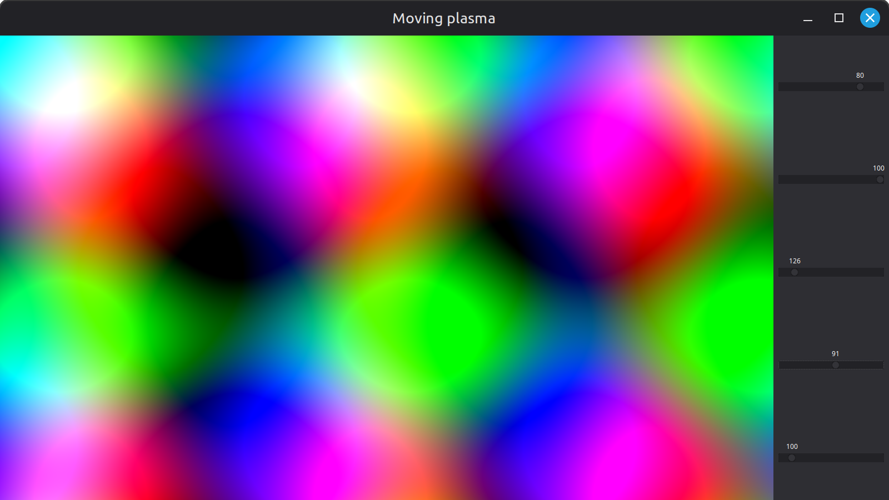

# Moving-plasma

Simple Swing animation with following principles applied:
- no external library is used
- every frame is rendered
- maximum frame rate is controlled
- memoization is used to speed up computing
- Stream parallelism (fork and join) is used to speed up computing
- FMA is used to speed up computing

## Requirements

- JDK 25
- Maven 3.6.3+
- Git

## Run it

```shell
git clone https://github.com/Achaaab/moving-plasma.git
cd moving-plasma
mvn package
java -jar target/moving-plasma.jar
```

## Screenshots


## Authors
* **Jonathan Guéhenneux** - *Programmer* - [Achaaab](https://github.com/Achaaab)

## License
This project is licensed under the GNU General Public License (GPL) - see the [LICENSE.md](LICENSE.md) for the details.
